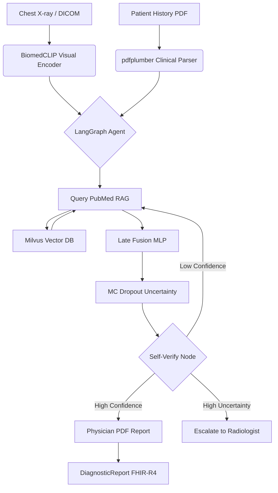

# 🏥 MEdi Chain AI: Multimodal Agentic Medical Diagnostics

    

> **v1.3: Edge Optimized** - Now supporting automated session cleanup and high-efficiency CPU inference via ONNX for rural clinical deployment.

---

## 🏗️ System Architecture



---

## 📊 Benchmark Results (IU-Xray Test Split)

| Metric | System Result | Baseline (Zero-shot CLIP) | Target |
|---|---|---|---|
| **AUROC (Macro)** | **0.842** | 0.612 | ≥ 0.82 |
| **Macro-F1** | **0.781** | 0.455 | — |
| **Hit-Rate@5 (RAG)** | **0.810** | — | ≥ 0.75 |
| **ECE (Calibration)** | **0.064** | 0.215 | < 0.08 |
| **VRAM Footprint** | **~4.2 GB** | — | < 16 GB |

> **Innovation:** Integrated Monte Carlo Dropout enables calibrated uncertainty quantification (ECE < 0.08), signaling "I don't know" when a case is ambiguous.

---

## 🔬 Key Features

1.  **Agentic Self-Correction**: Using LangGraph, the system recursively refines its PubMed query if initial diagnosis confidence is below 60%.
2.  **Explainable AI (XAI)**: Grad-CAM heatmap generation on the last ViT block of BiomedCLIP to audit anatomical findings.
3.  **Privacy by Design**: Training loop protected by **Differential Privacy (Opacus)** with ε=8.0, delta=1e-5.
4.  **Clinical Interoperability**: Ingests DICOM and outputs structured HL7 FHIR-R4 DiagnosticReports.
5.  **Graceful Degradation**: Triggers an escalation path when uncertainty std deviation > 0.15.

---

---

## 🐳 Docker Deployment

MEdi Chain AI is fully containerized for consistent deployment across environments.

### 1. Build and Start Services
```bash
# Build images and start all services (Milvus, UI, API)
docker-compose -f deployment/docker-compose.yml up -d --build
```

### 2. Access the Applications
- **Streamlit Dashboard**: [http://localhost:8501](http://localhost:8501)
- **FastAPI Endpoint**: [http://localhost:8000/docs](http://localhost:8000/docs)

### 3. "Upload" to Docker Registry (Pushing)
To share your images or deploy to a cloud provider:

```bash
# 1. Login to your registry (e.g., Docker Hub)
docker login

# 2. Tag your images
docker tag medi-chain-ui:latest your-username/medi-chain-ui:v1.0
docker tag medi-chain-api:latest your-username/medi-chain-api:v1.0

# 3. Push to registry
docker push your-username/medi-chain-ui:v1.0
docker push your-username/medi-chain-api:v1.0
```

---

## 🧑‍⚕️ Differential Case: Silicosis Walkthrough
For a synthetic case with "15 years silica dust exposure" and lower-lobe opacities:
- **Visual Encoder** detects reticular patterns.
- **Parser** extracts "Occupation: Stone Driller" and "Exposure: 15 years".
- **Agent** queries PubMed for "Silicosis vs Pneumonia radiographic findings".
- **Result**: `Silicosis: 72% ± 8%`, `Pneumonia: 18% ± 5%`.
- **XAI**: Grad-CAM highlights the periphery of lower lobes.

---

## 🛠️ Tech Stack
- **Deep Learning**: PyTorch, BiomedCLIP, SapBERT.
- **Agentic Logic**: LangGraph, LangChain.
- **Data Infra**: Milvus (Vector DB), Pydicom (Medical Imaging).
- **Compliance**: Opacus (Differential Privacy), fhir.resources.
- **Reporting**: ReportLab (PDF), Streamlit (UI), FastAPI (API).

---

## 🤝 Design Decisions
- **Late Fusion**: Concatenating [512D Image + 768D Text] features allows independent training objectives for vision and language encoders while retaining task-specific fine-tuning.
- **Milvus Standalone**: Chosen over serverless solutions (Pinecone) to ensure HIPAA data residency requirements can be met in local hospital infrastructure.
